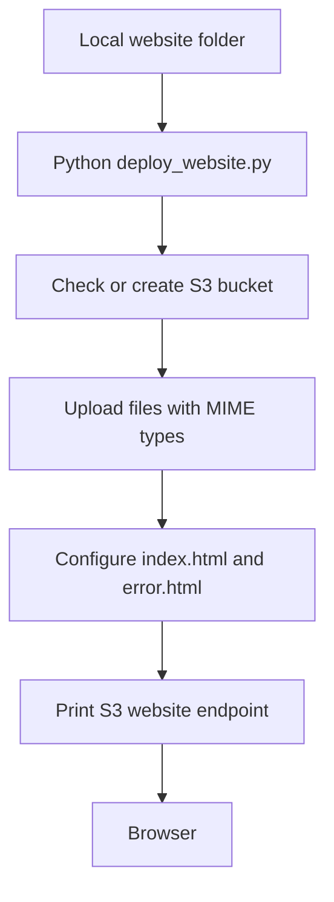
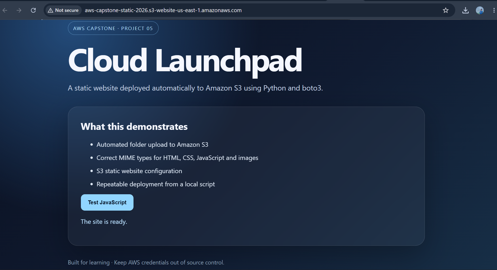
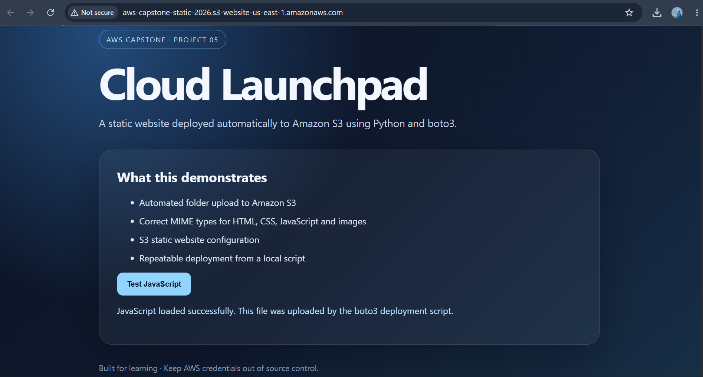
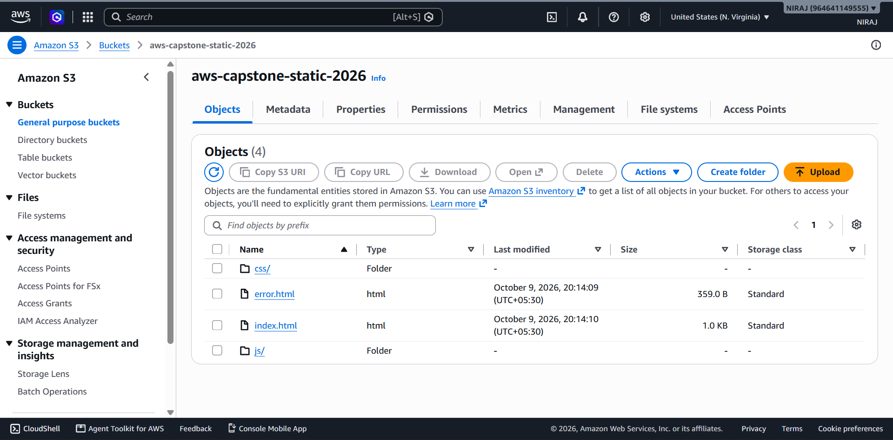
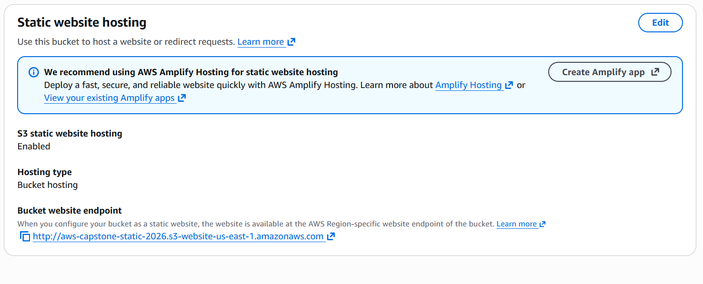

# Automated Static Website Hosting Using AWS SDK

## Objective
Deploy a static HTML/CSS/JavaScript website to Amazon S3 by running a Python script with `boto3`, rather than uploading every file manually in the AWS Console.

## AWS services and technologies
- Amazon S3 — stores website files and serves the static site
- Python 3.10+ and `boto3` — automate bucket checks, uploads and website configuration
- AWS CLI (optional) — configure credentials locally

## Architecture / workflow


## Prerequisites
1. An AWS account and a globally unique bucket name.
2. Python 3.10 or newer.
3. AWS credentials configured locally using an IAM identity with only the required S3 permissions.
4. Do not put access keys in this repository or in the script.

## Implementation steps
### 1. Create a virtual environment
Windows PowerShell:
```powershell
cd 05-automated-static-website-hosting
py -m venv .venv
.\.venv\Scripts\Activate.ps1
pip install -r requirements.txt
```
macOS/Linux:
```bash
python3 -m venv .venv
source .venv/bin/activate
pip install -r requirements.txt
```

### 2. Configure AWS credentials
Use `aws configure` if AWS CLI is installed, or use an approved IAM role/credential provider. Never commit `~/.aws/credentials`, access keys, or `.env` files. Prefer temporary credentials where possible.

### 3. Choose a unique bucket name
Bucket names are globally unique. Replace `my-unique-capstone-bucket-12345` with your own name.

Create a bucket and upload:
```bash
python deploy_website.py --bucket my-unique-capstone-bucket-12345 --region ap-south-1 --create-bucket
```
The script configures hosting and uploads the files. It does not make the website public by default.

### 4. Make a demo website publicly readable (optional)
For a classroom demo only, if your instructor permits public website access:
```bash
python deploy_website.py --bucket my-unique-capstone-bucket-12345 --region ap-south-1 --public-read-demo
```
Then ensure S3 Block Public Access settings and account-level policies permit the public-read policy. This may be prohibited by your organization's security settings. Public S3 website endpoints use HTTP and are not suitable for sensitive content. For a production deployment, use CloudFront with Origin Access Control and HTTPS.

### 5. Open the endpoint
The script prints the regional S3 website endpoint. Open it only after public access is intentionally configured. If it returns 403, check bucket policy and Block Public Access settings.

## IAM permissions
Use a dedicated IAM identity and restrict the resource to your chosen bucket. Depending on whether you create the bucket, permissions can include:
- `s3:HeadBucket` / `s3:ListBucket`
- `s3:CreateBucket` (only if the script should create it)
- `s3:PutObject`
- `s3:PutBucketWebsite`
- `s3:PutBucketPolicy` (only when using `--public-read-demo`)

Avoid broad `s3:*` permissions in a real deployment. Bucket creation and website configuration may require additional resource-level permissions or policy adjustments for your environment.

## Project Screenshots

### Live Website


### JavaScript Test


### S3 Uploaded Files


### S3 Hosting Configurations


Do not fabricate screenshots; capture them after running the project in your AWS account.

## Testing checklist
- [ ] Uploads nested folders such as `css/` and `js/`
- [ ] CSS and JavaScript load in the browser
- [ ] HTML files have `text/html` content type
- [ ] Re-running the script updates existing files
- [ ] Missing bucket gives a helpful message
- [ ] Public access remains disabled unless deliberately enabled

## Key learnings
- How SDKs automate repetitive cloud tasks
- S3 object keys and content types
- Static website hosting configuration
- IAM least privilege and public-access risks
- Repeatable deployment scripts

## Cleanup
Delete the test bucket only after confirming it contains no needed data. First remove objects, then delete the bucket. Review AWS pricing and account policies before creating resources.

## GitHub upload
Commit this project folder and its README to your own repository. Add screenshots you captured to a `screenshots/` folder and link them here. Never commit AWS credentials.
